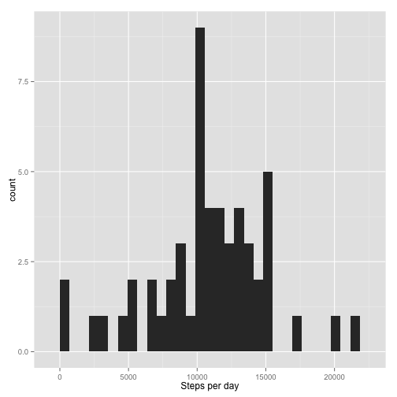
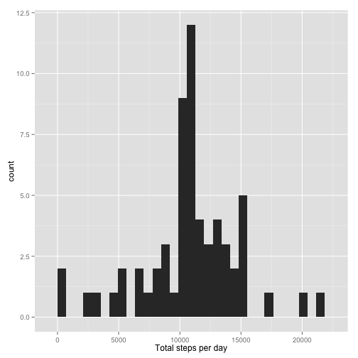
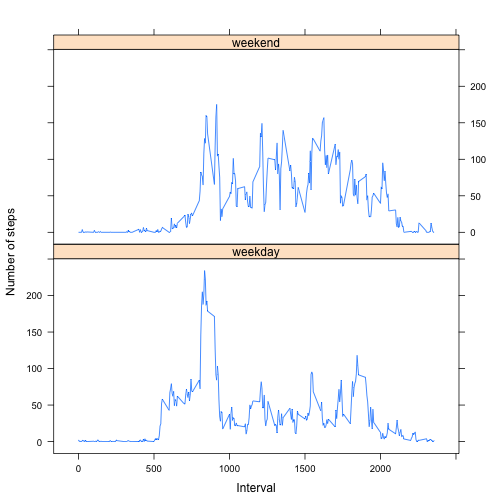

####Purpose: Summarize data from a personal activity monitoring device.  This device collects data at 5 minute intervals through out the day. The data consists of two months of data from an anonymous individual collected during the months of October and November, 2012 and include the number of steps taken in 5 minute intervals each day.

###Load data


```r
library(ggplot2)
library(dplyr)
library(lattice)
a <- read.csv("activity.csv")
```

###What is mean total number of steps taken per day?

Calculate the total number of steps taken per day


```r
steps_dat <- aggregate(steps ~ date, a, FUN=sum)
```

Make a histogram of the total number of steps taken each day


```r
qplot(steps_dat$steps, geom="histogram", xlab='Steps per day')
```

```
## stat_bin: binwidth defaulted to range/30. Use 'binwidth = x' to adjust this.
```

 

Calculate and report the mean and median of the total number of steps taken per day


```r
mean(steps_dat$steps)
```

```
## [1] 10766.19
```

```r
median(steps_dat$steps)
```

```
## [1] 10765
```

###What is the average daily activity pattern?

Make a time series plot (i.e. type = "l") of the 5-minute interval (x-axis) and the average number of steps taken, averaged across all days (y-axis)


```r
steps_int <- aggregate(steps ~ interval, a, FUN=mean)
with(steps_int, plot(steps ~ interval, type = 'l'))
```

 

Which 5-minute interval, on average across all the days in the dataset, contains the maximum number of steps?


```r
steps_int[steps_int$steps == max(steps_int$steps),]
```

```
##     interval    steps
## 104      835 206.1698
```

###Imputing missing values

Calculate and report the total number of missing values in the dataset (i.e. the total number of rows with NAs)


```r
sum(is.na(a$steps))
```

```
## [1] 2304
```

Create a new dataset that is equal to the original dataset but with the missing data filled in with the average number of steps for each period.


```r
a_imp <- a
a_imp$steps <- with(left_join(a, steps_int, by='interval'), ifelse(is.na(steps.x), steps.y, steps.x))
```

Make a histogram of the total number of steps taken each day and Calculate and report the mean and median total number of steps taken per day.


```r
qplot(aggregate(steps ~ date, a_imp, FUN=sum)$steps, geom="histogram", xlab='Total steps per day')
```

```
## stat_bin: binwidth defaulted to range/30. Use 'binwidth = x' to adjust this.
```

 

```r
mean(aggregate(steps ~ date, a_imp, FUN=sum)$steps)
```

```
## [1] 10766.19
```

```r
median(aggregate(steps ~ date, a_imp, FUN=sum)$steps)
```

```
## [1] 10766.19
```

###Are there differences in activity patterns between weekdays and weekends?

Create a new factor variable in the dataset with two levels – “weekday” and “weekend” indicating whether a given date is a weekday or weekend day.


```r
a$weekday <- as.factor(ifelse(weekdays(as.Date(a$date)) %in% c('Saturday','Sunday'), 'weekend', 'weekday'))
```

Make a panel plot containing a time series plot (i.e. type = "l") of the 5-minute interval (x-axis) and the average number of steps taken, averaged across all weekday days or weekend days (y-axis).


```r
steps_int_day <- aggregate(steps ~ interval + weekday, a, FUN=mean)
with(steps_int_day, xyplot(steps ~ interval | weekday, type = 'l', xlab='Interval', ylab='Number of steps', layout=c(1,2)))
```

 
